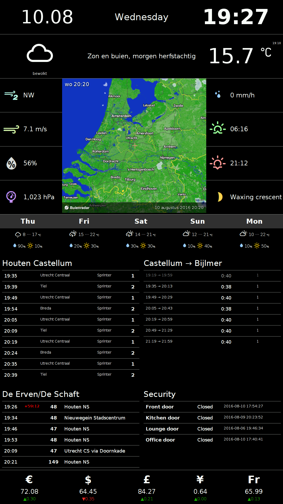

InfoPi Information server application
=====================================

Represents a single-page web application that displays various live data, like weather forecast and train departure
times.

The back-end (web server) part is using [Python 3](https://docs.python.org/3/). The front-end is written on [AngularJS 1.x](https://angularjs.org/) and [Twitter Bootstrap 3.x](http://getbootstrap.com/).

My own implementation is specifically crafted for:

* RaspberryPi running [Raspbian Jessie](https://www.raspberrypi.org/downloads/raspbian/).
* Full HD monitor (1920&times;1080 pixels) in the portrait orientation.

This is how the information page looks like:



Dependencies
============

1. Python 3.6
2. dateutil


Getting started
===============

1. Clone the `infopi` git repo *with submodules*:

    `git clone --recurse https://github.com/yktoo/infopi.git`

2. Install `dateutil`. In Ubuntu/Debian:

    `sudo apt-get install python3-dateutil`

3. Request an NS API key [here](https://apiportal.ns.nl/).
4. Once you have the key, open the file `ns_api_key.sample.py`, update the properties and save it as `ns_api_key.py`.
5. Start the server:

    `./infopi`

6. Open a web browser and direct it to [localhost:8000](http://localhost:8000/). If you're using Chrome or Chromium,
   the command line is:

   `chromium-browser --incognito --kiosk http://localhost:8000/`

7. In order to make InfoPi start at bootup, you can add the following commands to `~/.config/lxsession/LXDE-pi/autostart`:

```bash
# Optional: remote desktop server that would allow
# to connect to your Pi via VNC
x11vnc -forever

# InfoPi web server
/path/to/your/infopi/infopi

# Browser
chromium-browser --incognito --kiosk http://localhost:8000/
```


License
=======

See [LICENSE](LICENSE).


Credits
=======

* [AngularJS](https://angularjs.org/)
* [Twitter Bootstrap](http://getbootstrap.com/)
* Weather Icons by [Erik Flowers](https://erikflowers.github.io/weather-icons/)


Data providers
==============

* Weather info: [Buienradar.nl](http://buienradar.nl/)
* Train info: [Nederlandse Spoorwegen](http://www.ns.nl/)
* Bus info: [openOV](http://openov.nl/)
* Exchange rates: [European Central Bank](https://www.ecb.europa.eu/)
