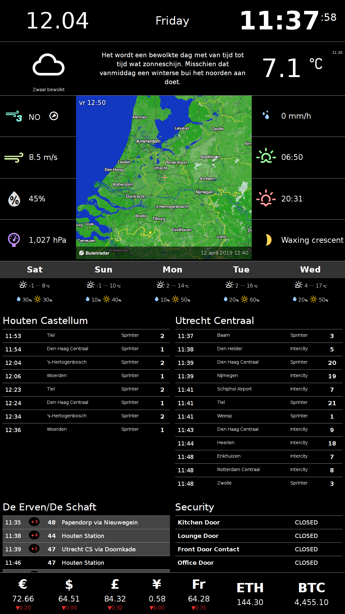

InfoPi Information server application
=====================================

Represents a single-page all-in-one web application that displays various live data, like weather forecast and train departure times. The application is developed with [Angular](https://angular.io/) 9.x.

My own implementation is specifically crafted for:

* RaspberryPi running [Raspbian Stretch](https://www.raspberrypi.org/downloads/raspbian/).
* Full HD monitor (1920&times;1080 pixels) in the portrait orientation.

This is how the information page looks like:



Dependencies
============

In order to build the package:

* Node 13+
* npm 6+
* [Angular CLI](https://angular.io/cli)

Getting started
===============

1. Clone the `infopi` git repo:

    `git clone https://github.com/yktoo/infopi.git`

2. Run in the project directory:

    `npm install`

3. Request an NS API key [here](https://apiportal.ns.nl/).
4. Once you have the key, open the file `src/environments/config.sample.ts`, update the properties and save it as `config.ts`.
5. Test the application:

    `npm electron`

6. To create a DEB package for your current architecture run `npm package`, to create a package for Raspberry Pi run `npm package:rpi`. The package will be created as `dist/installers/infopi_XXX_YYY.deb`

7. Once you have the `.deb`, copy it onto your Raspberry Pi and install using:

    `sudo dpkg -i infopi_XXX_YYY.deb`
    
8. Test your setup: run `infopi`

9. In order to make InfoPi start at bootup, you can add the following commands to `~/.config/lxsession/LXDE-pi/autostart`:

```bash
# Optional: remote desktop server that would allow to connect to your Pi via VNC
x11vnc -forever

# InfoPi app
infopi
```


License
=======

See [LICENSE](LICENSE).


Credits
=======

* [Angular](https://angular.io/)
* Weather Icons by [Erik Flowers](https://erikflowers.github.io/weather-icons/)


Data providers
==============

* Weather info: [Buienradar.nl](http://buienradar.nl/)
* Train info: [Nederlandse Spoorwegen](http://www.ns.nl/)
* Bus info: [openOV](http://openov.nl/)
* Exchange rates: [European Central Bank](https://www.ecb.europa.eu/)
