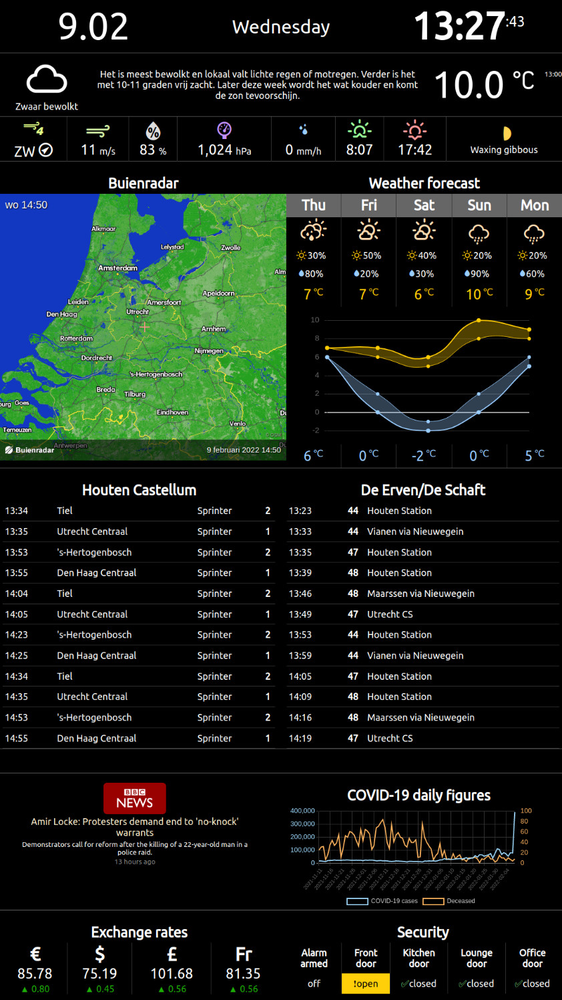

## InfoPi Information server application

**InfoPi** is a single-page web application that displays various live data, like weather forecast and train departure times. The application is developed with Angular 9.x and can be packaged with the Electron browser to make an all-in-one executable bundle.

My own implementation was crafted for Raspberry Pi running [Raspbian Stretch](https://www.raspberrypi.org/downloads/raspbian/) and a full HD monitor (1920&times;1080 pixels) in the portrait orientation, but it will (supposedly) run on any platform that Electron supports and properly adapt itself to a broad range of resolutions.

This is how the information page looks like:



## Dependencies

In order to build the package you will need:

* [Node 13+ and npm 6.10+](https://nodejs.org/)
* [Angular CLI](https://angular.io/cli)

## Getting started

1. Run in the terminal:
```bash
# Clone the git repository
git clone https://github.com/yktoo/infopi.git

# Install NPM modules
cd infopi
npm install

# Copy the sample configuration
cp src/environments/config.sample.ts src/environments/config.ts
```
2. If you plan to use train information, request an NS API key [here](https://apiportal.ns.nl/).
3. Edit the file `src/environments/config.ts` you copied on step `1` and update values in it. Also put the NS API key there if you have one.\
The file provides some sane initial values, like refresh intervals. You are encouraged to change stuff like the weather station or bus stop as you see fit.
4. Test the application:
```bash
npm run electron
```
You should see a new browser window started in the kiosk mode (use <kbd>Ctrl+Q</kbd> to exit or <kbd>Ctrl+Shift+I</kbd> to open Developer Tools and diagnose problems).

## Packaging

To create a `.deb` package for your current architecture run `npm run package`.

To create a package for Raspberry Pi run `npm run package:rpi`.

The packages will be created as `dist/installers/infopi_XXX_YYY.deb`

## Installing

Once you have a `.deb`, copy it onto your Raspberry Pi and install using:

```bash
sudo dpkg -i infopi_XXX_YYY.deb
```

To test your setup, run `infopi` from the command line or use the Application menu launcher created by the package.

## Finishing touch

In order to make InfoPi start at bootup, you can add the following commands to `~/.config/lxsession/LXDE-pi/autostart`:

```bash
# Optional: remote desktop server that would allow to connect to your Pi via VNC
x11vnc -forever

# InfoPi app
infopi
```


License
=======

See [LICENSE](LICENSE).


Credits
=======

* [Angular](https://angular.io/)
* [Chart.js](https://www.chartjs.org/)
* [ng2-charts](https://valor-software.com/ng2-charts/)
* [xml2js](https://www.npmjs.com/package/xml2js)
* [Weather Icons](https://erikflowers.github.io/weather-icons/)
* [Electron](https://www.electronjs.org/), [electron-packager](https://github.com/electron/electron-packager) and [electron-installer-debian](https://github.com/electron-userland/electron-installer-debian)


Data providers
==============

* Weather info: [Buienradar.nl](http://buienradar.nl/)
* Train info: [Nederlandse Spoorwegen](http://www.ns.nl/)
* Bus info: [openOV](http://openov.nl/)
* Exchange rates: [European Central Bank](https://www.ecb.europa.eu/)
* News: [BBC](https://www.bbc.co.uk/)
* Sensors: home automation server instance of [OpenHAB](https://www.openhab.org/).
